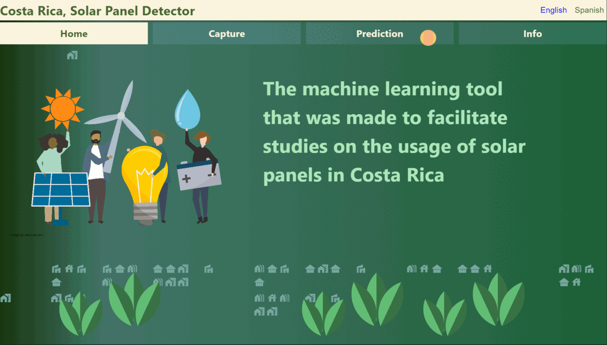
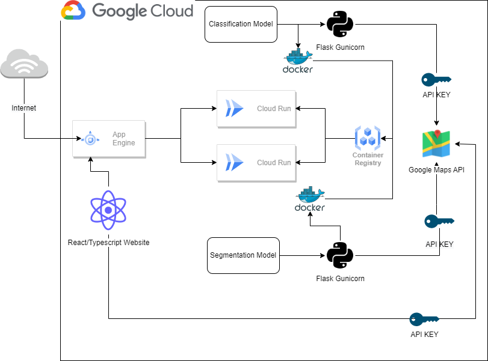

# Costa Rica, Solar Panel Detector

## Purpose.

This repository contains the code for a master's degree final project. 

## URL

https://costa-rica-solar.uc.r.appspot.com

## Website Preview




## Architecture.



## Area: 

Artificial Intelligence/ Full Stack Development.


## Stack:

- Web client: React, Typescript
- Model: Python, Pytorch.

## Installation: 

Each folder contains instructions on how to execute the different pieces,
since it's a full stack/machine learning combination there will be different steps required.

Main requisites will include a running version of Python and Node JS in your system.

**Important! The API KEY's that appeagitr only works under an specific DNS. The website might not work fully unless a new API KEY is in place.**

## Citation

```
@misc{carlosan1708:2023,
  Author = {Carlos Rodriguez Trigueros},
  Title = {Costa Rica, Solar Panel Detector},
  Year = {2023},
  Publisher = {GitHub},
  Journal = {GitHub repository},
  Howpublished = {\url{https://github.com/carlosan1708/MasterTFM}}
}
```

## Credits:

##### Guidance:

Dr. Carlos Gaitan Potayos.

##### Use of resources/libraries:

Pavel Iakubovskii, Segmentation Models, (2019), Github Repository
https://github.com/qubvel/segmentation_models
  
Takumi Karasawa, PyTorch Image Classification, (2022), Github Repository
https://github.com/karasawatakumi/pytorch-image-classification


## Disclaimer

The code is provided as it is. It may work in your computer, it may not work. It may even crash it or create a paradox that could ultimately unravel the very fabric of the space-time continuum and destroy the entire universe. Just be careful and try to understand everything before using it. If you have questions, please carefully read the code. If this doesn't help, contact us. If you want to blame us for some reason, do not contact us.