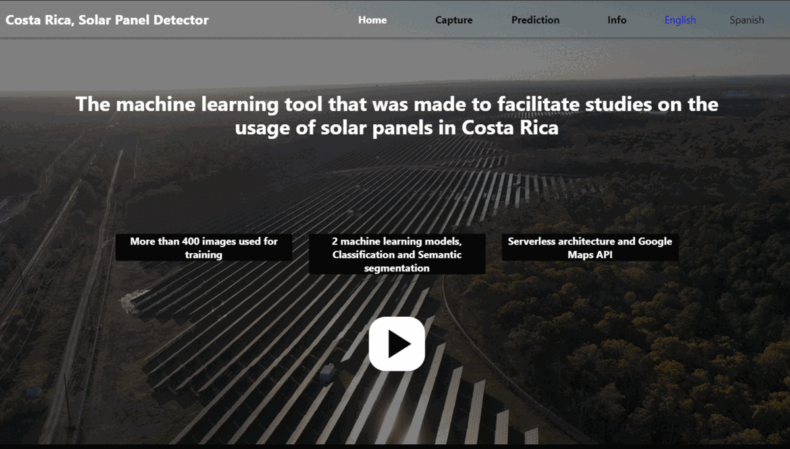

# Costa Rica, Solar Panel Detector

## Purpose.

This repository contains the code for a master's degree final project. 

## URL

https://costa-rica-solar.uc.r.appspot.com

## Website Preview

## Architecture.

## Area: 
Artificial Intelligence/ Full Stack Development.

## Stack:

Web client: React, Typescript
Model: Python, Pytorch.

## Installation: 

Each folder contains instructions on how to execute the different pieces,
since it's a full stack/machine learning combination there will be different steps required.

Main requisites will include a running version of Python and Node JS in your system.

### Important:
To be able to share the code, the API KEY's that appear have been disabled. 
The website might not work fully unless a new API KEY is in place. 
Main repository for UOC Final Master's degree work. 

